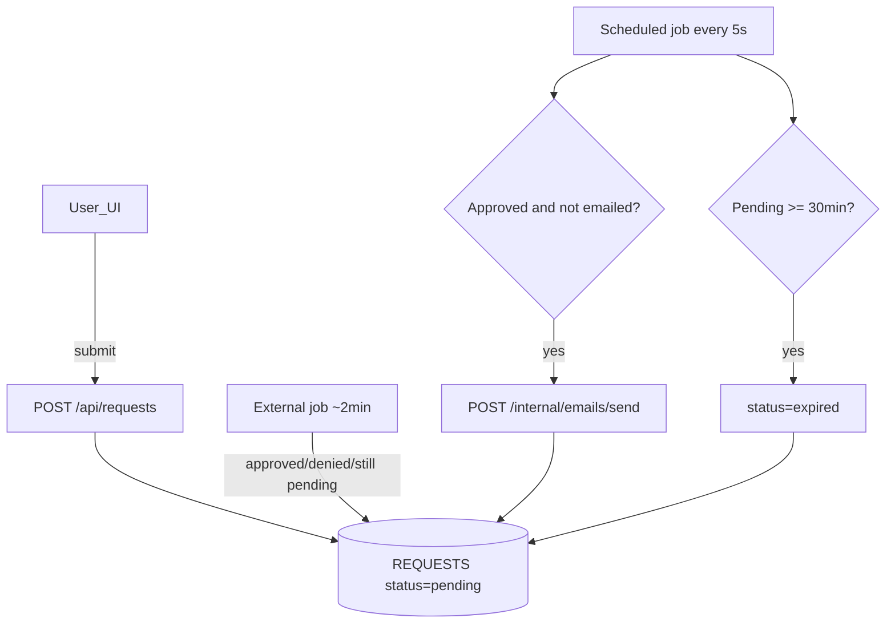
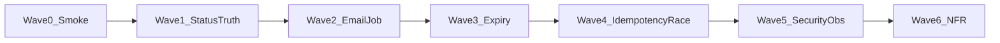

# Part 1 — Risk-Based Test Plan: Request Lifecycle

**Assignment:** Talkspace Senior Full Stack QA Engineer — Take-Home (Part 1)  
**Author:** _(fill in)_  
**Version:** 1.0  
**Date:** 2026-08-02  
**Status:** Ready for execution

---

## 1. Purpose & Scope

### 1.1 Purpose

Define a **risk-based (RBT)** test plan for the request lifecycle feature described in the take-home assignment. The plan is written for a QA team to execute consistently: same priorities, same oracles, same automation guidance.

### 1.2 In scope

| Layer | What we test |
|---|---|
| **UI** | User submits a request through the application UI |
| **Client API** | `POST /api/requests`, `GET /api/requests/{requestId}` |
| **Internal API** | Status update, job trigger, email send, job history |
| **Background jobs** | ~2 min external status update path; 5s scheduled job (email + expiry) |
| **Data** | `USERS`, `REQUESTS`, `CRON_TASK_HISTORY`, `AUDIT_LOGS` |
| **Observability** | Application logs, cron history, audit trail |

### 1.3 Out of scope (Part 1)

- Talkspace signup flow (Part 2 — Playwright on `app.canary.talkspace.com`)
- Full performance/load testing beyond a bounded backlog check
- Email provider SLA / deliverability (we verify **send intent** via DB flag, logs, and mail catcher if available)

### 1.4 System under test (summary)

**Status values:** `pending`, `approved`, `denied`, `expired`  
**Key flags:** `email_sent` (boolean on `REQUESTS`)

### 1.5 Environments & access

| Environment | Access | Notes |
|---|---|---|
| QA / Staging | Client APIs, Internal APIs, DB read/write, logs | Primary execution target |
| Local (if provided) | Same | Use for automation development |

**Test personas**

| Persona | Role | Used for |
|---|---|---|
| End user | Submits requests via UI or client API | Create + read own request |
| Internal ops / system | Calls `/internal/*` endpoints and jobs | Status updates, job runs, email triggers |

### 1.6 Release exit criteria

- All **P0** test cases: **Pass** (or documented waiver with product sign-off)
- No open **Critical/High** bugs on email duplication, wrong expiry, or illegal status corruption
- Regression smoke pack (**R-SMOKE-01** … **R-SMOKE-06**) green before any release candidate

---

## 2. Assumptions & Ambiguities

Document assumptions explicitly. Where the spec is silent, tests record **actual behavior** and flag for product clarification.

| ID | Topic | Assumption for testing | Ambiguity / question for product |
|---|---|---|---|
| A1 | External ~2 min job | A separate offline process updates status after ~2 minutes; may set `approved`, `denied`, or leave `pending`. We simulate via `PATCH /internal/requests/{id}/status` or `POST /internal/jobs/process-requests` depending on which endpoint maps to which job. | Is `POST /internal/jobs/process-requests` the 2 min updater, the 5s scheduler, or both? |
| A2 | Approval decision logic | Business rules for approve vs deny vs stay pending are **out of scope** unless documented; we test that each terminal/non-terminal status behaves correctly once set. | What criteria drive Approved vs Denied vs remain Pending? |
| A3 | `priority` column | Stored on create; **not** used for email/expiry ordering unless spec confirms. Covered by one exploratory case. | Is priority used for job ordering or SLA? |
| A4 | Terminal states | `expired` and `denied` are terminal; no backward transition to `pending` or `approved` without explicit product rule. | Can statuses transition backward? Which states are terminal? |
| A5 | Email success semantics | `email_sent=true` only after successful send (not before). On failure, flag stays `false` and job retries on next run. | Retry policy? Max attempts? Dead-letter? |
| A6 | Email observation | Primary oracle: `REQUESTS.email_sent` + `AUDIT_LOGS` + app logs. Secondary: mail catcher / provider stub if available. | How do we observe email content/recipient in QA? |
| A7 | Internal API security | `/internal/*` requires service auth (mTLS, API key, or internal network). If unauthenticated in QA, treat as **Critical** product risk. | Authn/Authz model for internal endpoints? |
| A8 | UI contract | UI submit produces the same DB row as `POST /api/requests` with valid `userId`. UI details not fully specified — API/DB are primary oracles. | UI fields, validation, and error messages? |
| A9 | Time control | QA may set `created_at` / `status_updated_at` via DB for boundary tests instead of waiting 30 minutes. | Is backdating timestamps allowed in QA DB? |
| A10 | Multi-server cron | Multiple app servers may run the 5s job; processing must be idempotent (no duplicate emails). | Distributed lock / leader election mechanism? |

---

## 3. Risk Register (RBT)

Tests are selected and ordered by risk, not by API alphabetical order.

| Risk ID | Risk description | Impact | Likelihood | Priority | Mitigating test IDs |
|---|---|---|---|---|---|
| **R1** | Approved request never emailed, or emailed twice | User trust; compliance; support load | Medium | **P0** | F-EMAIL-01, F-EMAIL-02, F-EMAIL-03, N-JOB-02, N-JOB-03, R-SMOKE-02 |
| **R2** | Pending request never expires after 30 minutes | Stale queue; capacity; SLA breach | Medium | **P0** | F-EXP-01, F-EXP-02, N-TIME-01, R-SMOKE-03 |
| **R3** | Denied or Expired request receives approval email | Wrong business outcome; user confusion | Low | **P0** | F-EMAIL-03, R-SMOKE-04, R-SMOKE-03 |
| **R4** | Invalid or illegal status transitions corrupt data | Data integrity; downstream bugs | Medium | **P0** | F-REQ-05, F-EXP-03 |
| **R5** | 5s job not idempotent under overlap / multi-server | Duplicate emails; double expiry | Medium | **P0** | N-JOB-02, N-JOB-03 |
| **R6** | Create/get API contract broken | Core path blocked | Low | **P0** | F-REQ-01, F-REQ-02, F-REQ-03, R-SMOKE-01, R-SMOKE-05 |
| **R7** | Time boundaries wrong (29m59s vs 30m; ~2m external path) | Flaky prod behavior | Medium | **P1** | N-TIME-01, N-TIME-02 |
| **R8** | Audit / cron history missing or inaccurate | Poor supportability | Medium | **P1** | F-REQ-01, N-JOB-01, N-OBS-01, R-SMOKE-06 |
| **R9** | Internal APIs unauthenticated or spoofable | Security breach | Low–Med | **P1** | S-01, S-02 |
| **R10** | UI/API/DB status drift | User sees wrong state | Medium | **P1** | F-UI-01, F-REQ-02, R-SMOKE-05 |
| **R11** | Job fails silently under backlog | Delayed emails/expiry | Low | **P2** | N-PERF-01, N-OBS-01 |
| **R12** | `priority` column behavior undefined | Wrong ordering if used later | Low | **P2** | F-REQ-06 |

---

## 4. Test Strategy

### 4.1 Test type definitions

| Type | Definition | Examples in this plan |
|---|---|---|
| **Functional** | Correct business behavior for a given input and state | Create pending; approve; send email once; expire after 30m; deny without email |
| **Non-functional** | Timing, cadence, concurrency, idempotency, throughput, observability | 5s cron cadence; 30m boundary; double job run; backlog processing |
| **Regression** | Minimal smoke pack re-run after every change to prove the spine still works | R-SMOKE-01 … R-SMOKE-06 (subset overlaps functional — tagged explicitly) |

### 4.2 Subtype tags

`Positive` · `Negative` · `Boundary` · `Idempotency` · `Concurrency` · `Timing`

### 4.3 Automation strategy

| Guideline | Rule |
|---|---|
| Default | Automate deterministic **API + DB** outcomes |
| Timing | Use **DB timestamp manipulation** or internal job trigger — avoid `sleep(30m)` in CI |
| UI | Playwright only where UI is available; keep count low |
| Manual | Exploratory UI, log forensics, multi-server race observation, ambiguity confirmation |

| Tool | When to use |
|---|---|
| **Playwright (UI)** | UI submit, status display, user-visible errors |
| **Playwright API** | Client + internal HTTP contracts; fast CI checks via `request` fixture |
| **Integration (job + DB)** | Cron/job runs with DB assertions on `REQUESTS`, `CRON_TASK_HISTORY`, `AUDIT_LOGS` |
| **Manual** | Security exploration, multi-server races, product ambiguity, mail content review |
| **N/A** | Pure documentation / blocked cases |

### 4.4 Priority execution rule

1. Run **Wave 0 (Regression smoke)** first — environment sanity  
2. Complete all **P0** cases before **P1**  
3. **P2** as time permits or next sprint  

---

## 5. Execution Waves

| Wave | Name | Scope (test IDs) | Exit criteria |
|---|---|---|---|
| **0** | Smoke / Regression | R-SMOKE-01 … R-SMOKE-06 | App up; create works; approve→email; expire path; cron history written |
| **1** | Status truth | F-REQ-01 … F-REQ-06, F-REQ-05 | CRUD + transitions + validation correct |
| **2** | Email job | F-EMAIL-01 … F-EMAIL-03 | Email only for approved-not-sent; no duplicates |
| **3** | Expiry | F-EXP-01 … F-EXP-03, N-TIME-01 | 30m rule correct; non-pending not expired |
| **4** | Idempotency / concurrency | N-JOB-02, N-JOB-03 | No duplicate side effects |
| **5** | Security & observability | S-01, S-02, N-JOB-01, N-OBS-01 | Internal access controlled; history/logs trustworthy |
| **6** | NFR / timing | N-TIME-02, N-PERF-01 | External path timing; backlog handled |

---

## 6. Test Case Index

Quick reference for leads and sprint planning.

| ID | Area | Type | Subtype | Risk | Priority | Title | Execution | Automation Tool |
|---|---|---|---|---|---|---|---|---|
| R-SMOKE-01 | API | Regression | Positive | R6 | P0 | Create request → pending | Automate | Playwright API |
| R-SMOKE-02 | Job / Email | Regression | Positive | R1 | P0 | Approve → job → emailed once | Automate | Integration (job+DB) |
| R-SMOKE-03 | Job / Expiry | Regression | Positive | R2, R3 | P0 | Aged pending → expired, not emailed | Automate | Integration (job+DB) |
| R-SMOKE-04 | Job / Email | Regression | Negative | R3 | P0 | Deny → not emailed | Automate | Integration (job+DB) |
| R-SMOKE-05 | API / Data | Regression | Positive | R6, R10 | P0 | GET matches DB after transitions | Automate | Playwright API |
| R-SMOKE-06 | Observability | Regression | Positive | R8 | P0 | Cron history row on successful run | Automate | Integration (job+DB) |
| F-REQ-01 | API / Data | Functional | Positive | R6, R8 | P0 | Create request — happy path | Automate | Playwright API |
| F-REQ-02 | API / Data | Functional | Positive | R6, R10 | P0 | GET request details match DB | Automate | Playwright API |
| F-REQ-03 | API | Functional | Negative | R6 | P0 | Create with invalid/missing userId | Automate | Playwright API |
| F-REQ-04 | API / Data | Functional | Positive | R4 | P0 | PATCH status to approved/denied | Automate | Playwright API |
| F-REQ-05 | API / Data | Functional | Negative | R4 | P0 | Illegal status transitions rejected | Automate | Playwright API |
| F-REQ-06 | Data | Functional | Boundary | R12 | P2 | Priority field stored; no unintended ordering | Manual | N/A |
| F-EMAIL-01 | Job / Email | Functional | Positive | R1 | P0 | Approved + not sent → email + flag set | Automate | Integration (job+DB) |
| F-EMAIL-02 | Job / Email | Functional | Idempotency | R1, R5 | P0 | Already sent → no second email | Automate | Integration (job+DB) |
| F-EMAIL-03 | Job / Email | Functional | Negative | R3 | P0 | Non-approved statuses → no email | Automate | Integration (job+DB) |
| F-EXP-01 | Job / Expiry | Functional | Positive | R2 | P0 | Pending ≥30m → expired | Automate | Integration (job+DB) |
| F-EXP-02 | Job / Expiry | Functional | Negative | R2 | P0 | Pending <30m → stays pending | Automate | Integration (job+DB) |
| F-EXP-03 | Job / Expiry | Functional | Negative | R4 | P0 | Approved/denied not auto-expired | Automate | Integration (job+DB) |
| F-UI-01 | UI | Functional | Positive | R10 | P1 | UI submit creates pending request | Manual | Playwright (UI) |
| N-TIME-01 | Job / Expiry | Non-functional | Boundary | R7 | P1 | Expiry boundary 29m59s vs 30m00s | Automate | Integration (job+DB) |
| N-TIME-02 | Job | Non-functional | Timing | R7 | P1 | External ~2m update — no premature email | Manual | N/A |
| N-JOB-01 | Observability | Non-functional | Timing | R8 | P1 | Cron cadence ~5s in history | Manual | N/A |
| N-JOB-02 | Job | Non-functional | Idempotency | R5 | P0 | Double job trigger — no duplicate email | Automate | Integration (job+DB) |
| N-JOB-03 | Job | Non-functional | Concurrency | R5 | P1 | Concurrent runs / multi-server — no dupes | Manual | N/A |
| N-PERF-01 | Job | Non-functional | Positive | R11 | P2 | Backlog of N approved-unsent processed | Manual | N/A |
| N-OBS-01 | Observability | Non-functional | Negative | R8, R11 | P1 | Failed job → history failed + logs | Manual | N/A |
| S-01 | Security | Functional | Negative | R9 | P1 | Internal APIs reject unauthorized calls | Automate | Playwright API |
| S-02 | Security | Functional | Negative | R9 | P1 | Cross-tenant / cross-user status update denied | Automate | Playwright API |

**Total: 28 test cases** (6 Regression · 14 Functional · 8 Non-functional)

---

## 7. Detailed Test Cases

Use **Pass/Fail**: `Not Run` | `Pass` | `Fail` | `Blocked` | `Skip`

---

### Wave 0 — Regression Smoke

#### R-SMOKE-01 — Create request → pending

| Field | Value |
|---|---|
| **Area** | API |
| **Type** | Regression |
| **Subtype** | Positive |
| **Risk / Priority** | R6 / P0 |
| **Preconditions** | Valid user exists in `USERS` (note `user_id`) |
| **Steps** | 1. `POST /api/requests` with body `{ "userId": <valid_id> }` 2. Note `requestId` from response 3. Query `REQUESTS` by id |
| **Expected Result** | HTTP 2xx; response `{ requestId, status: "pending" }`; DB row: `status=pending`, `email_sent=false`, `user_id` matches, `created_at` set |
| **Actual Result** | |
| **Pass/Fail** | Not Run |
| **Comment** | |
| **Execution** | Automate |
| **Automation Tool** | Playwright API |

#### R-SMOKE-02 — Approve → job → emailed once

| Field | Value |
|---|---|
| **Area** | Job / Email |
| **Type** | Regression |
| **Subtype** | Positive |
| **Risk / Priority** | R1 / P0 |
| **Preconditions** | Request in `approved`, `email_sent=false` (create pending → PATCH approved) |
| **Steps** | 1. Trigger scheduled job (`POST /internal/jobs/process-requests` or wait for cron) 2. Check `REQUESTS.email_sent` 3. Check mail catcher / logs 4. Re-run job once |
| **Expected Result** | After first run: `email_sent=true`; approval email sent once; second run: no additional email |
| **Actual Result** | |
| **Pass/Fail** | Not Run |
| **Comment** | |
| **Execution** | Automate |
| **Automation Tool** | Integration (job+DB) |

#### R-SMOKE-03 — Aged pending → expired, not emailed

| Field | Value |
|---|---|
| **Area** | Job / Expiry |
| **Type** | Regression |
| **Subtype** | Positive |
| **Risk / Priority** | R2, R3 / P0 |
| **Preconditions** | Request `status=pending`, `email_sent=false`; set `created_at` to ≥30 minutes ago (DB) |
| **Steps** | 1. Trigger scheduled job 2. Query `REQUESTS` 3. Check email/logs |
| **Expected Result** | `status=expired`; `email_sent` remains false; no approval email |
| **Actual Result** | |
| **Pass/Fail** | Not Run |
| **Comment** | |
| **Execution** | Automate |
| **Automation Tool** | Integration (job+DB) |

#### R-SMOKE-04 — Deny → not emailed

| Field | Value |
|---|---|
| **Area** | Job / Email |
| **Type** | Regression |
| **Subtype** | Negative |
| **Risk / Priority** | R3 / P0 |
| **Preconditions** | Request `status=denied`, `email_sent=false` |
| **Steps** | 1. Trigger scheduled job 2. Query `REQUESTS` 3. Check email/logs |
| **Expected Result** | Status stays `denied`; `email_sent=false`; no approval email |
| **Actual Result** | |
| **Pass/Fail** | Not Run |
| **Comment** | |
| **Execution** | Automate |
| **Automation Tool** | Integration (job+DB) |

#### R-SMOKE-05 — GET matches DB after transitions

| Field | Value |
|---|---|
| **Area** | API / Data |
| **Type** | Regression |
| **Subtype** | Positive |
| **Risk / Priority** | R6, R10 / P0 |
| **Preconditions** | Request exists; drive through pending → approved (or expired) |
| **Steps** | 1. After each state change, `GET /api/requests/{requestId}` 2. Compare to DB row |
| **Expected Result** | API `status`, timestamps align with DB (`status`, `status_updated_at`, `email_sent`) |
| **Actual Result** | |
| **Pass/Fail** | Not Run |
| **Comment** | |
| **Execution** | Automate |
| **Automation Tool** | Playwright API |

#### R-SMOKE-06 — Cron history row on successful run

| Field | Value |
|---|---|
| **Area** | Observability |
| **Type** | Regression |
| **Subtype** | Positive |
| **Risk / Priority** | R8 / P0 |
| **Preconditions** | At least one request eligible for job processing |
| **Steps** | 1. Note latest `CRON_TASK_HISTORY.id` 2. Trigger job 3. Query new history row |
| **Expected Result** | New row: `job_name` matches process job; `status=success` (or equivalent); `started_at` ≤ `finished_at`; `processed_records` ≥ 0 |
| **Actual Result** | |
| **Pass/Fail** | Not Run |
| **Comment** | |
| **Execution** | Automate |
| **Automation Tool** | Integration (job+DB) |

---

### Wave 1 — Status Truth (Functional)

#### F-REQ-01 — Create request — happy path

| Field | Value |
|---|---|
| **Area** | API / Data |
| **Type** | Functional |
| **Subtype** | Positive |
| **Risk / Priority** | R6, R8 / P0 |
| **Preconditions** | Valid user in `USERS` |
| **Steps** | 1. `POST /api/requests` `{ "userId": <id> }` 2. Query `REQUESTS` and `AUDIT_LOGS` |
| **Expected Result** | 2xx; `requestId` returned; DB: `pending`, `email_sent=false`; audit row: entity_type=request, action=created (or equivalent) |
| **Actual Result** | |
| **Pass/Fail** | Not Run |
| **Comment** | |
| **Execution** | Automate |
| **Automation Tool** | Playwright API |

#### F-REQ-02 — GET request details match DB

| Field | Value |
|---|---|
| **Area** | API / Data |
| **Type** | Functional |
| **Subtype** | Positive |
| **Risk / Priority** | R6, R10 / P0 |
| **Preconditions** | Known request id |
| **Steps** | 1. `GET /api/requests/{requestId}` 2. Query DB same id |
| **Expected Result** | All exposed fields match DB; no extra/missing sensitive fields |
| **Actual Result** | |
| **Pass/Fail** | Not Run |
| **Comment** | |
| **Execution** | Automate |
| **Automation Tool** | Playwright API |

#### F-REQ-03 — Create with invalid/missing userId

| Field | Value |
|---|---|
| **Area** | API |
| **Type** | Functional |
| **Subtype** | Negative |
| **Risk / Priority** | R6 / P0 |
| **Preconditions** | None |
| **Steps** | 1. POST with missing `userId` 2. POST with non-existent user id 3. POST with malformed body (wrong type) |
| **Expected Result** | 4xx with clear error; no orphan `REQUESTS` row created |
| **Actual Result** | |
| **Pass/Fail** | Not Run |
| **Comment** | |
| **Execution** | Automate |
| **Automation Tool** | Playwright API |

#### F-REQ-04 — PATCH status to approved/denied

| Field | Value |
|---|---|
| **Area** | API / Data |
| **Type** | Functional |
| **Subtype** | Positive |
| **Risk / Priority** | R4 / P0 |
| **Preconditions** | Pending request |
| **Steps** | 1. `PATCH /internal/requests/{id}/status` `{ "status": "approved" }` 2. Verify DB 3. Repeat on new request with `denied` |
| **Expected Result** | Status updated; `status_updated_at` refreshed; audit log entry for each change |
| **Actual Result** | |
| **Pass/Fail** | Not Run |
| **Comment** | |
| **Execution** | Automate |
| **Automation Tool** | Playwright API |

#### F-REQ-05 — Illegal status transitions rejected

| Field | Value |
|---|---|
| **Area** | API / Data |
| **Type** | Functional |
| **Subtype** | Negative |
| **Risk / Priority** | R4 / P0 |
| **Preconditions** | Requests in terminal states: `expired`, `denied` |
| **Steps** | 1. PATCH `expired` → `approved` 2. PATCH `denied` → `pending` 3. PATCH `approved` → `pending` (if applicable) |
| **Expected Result** | 4xx or no-op per spec; DB status unchanged; document actual if spec silent |
| **Actual Result** | |
| **Pass/Fail** | Not Run |
| **Comment** | Record actual behavior for product review |
| **Execution** | Automate |
| **Automation Tool** | Playwright API |

#### F-REQ-06 — Priority field stored; no unintended ordering

| Field | Value |
|---|---|
| **Area** | Data |
| **Type** | Functional |
| **Subtype** | Boundary |
| **Risk / Priority** | R12 / P2 |
| **Preconditions** | Ability to set/create requests with different `priority` values |
| **Steps** | 1. Create or update requests with priority A vs B 2. Run job with multiple approved-unsent 3. Observe processing order |
| **Expected Result** | Priority persisted correctly; if spec silent, order is documented (FIFO vs priority) — flag if undefined |
| **Actual Result** | |
| **Pass/Fail** | Not Run |
| **Comment** | Exploratory |
| **Execution** | Manual |
| **Automation Tool** | N/A |

---

### Wave 2 — Email Job (Functional)

#### F-EMAIL-01 — Approved + not sent → email + flag set

| Field | Value |
|---|---|
| **Area** | Job / Email |
| **Type** | Functional |
| **Subtype** | Positive |
| **Risk / Priority** | R1 / P0 |
| **Preconditions** | `approved`, `email_sent=false` |
| **Steps** | 1. Trigger job 2. Verify DB 3. Verify email/logs |
| **Expected Result** | `email_sent=true`; exactly one approval email; `AUDIT_LOGS` reflects send |
| **Actual Result** | |
| **Pass/Fail** | Not Run |
| **Comment** | |
| **Execution** | Automate |
| **Automation Tool** | Integration (job+DB) |

#### F-EMAIL-02 — Already sent → no second email

| Field | Value |
|---|---|
| **Area** | Job / Email |
| **Type** | Functional |
| **Subtype** | Idempotency |
| **Risk / Priority** | R1, R5 / P0 |
| **Preconditions** | `approved`, `email_sent=true` |
| **Steps** | 1. Trigger job twice 2. Count emails in catcher/logs |
| **Expected Result** | No additional emails; `email_sent` stays true |
| **Actual Result** | |
| **Pass/Fail** | Not Run |
| **Comment** | |
| **Execution** | Automate |
| **Automation Tool** | Integration (job+DB) |

#### F-EMAIL-03 — Non-approved statuses → no email

| Field | Value |
|---|---|
| **Area** | Job / Email |
| **Type** | Functional |
| **Subtype** | Negative |
| **Risk / Priority** | R3 / P0 |
| **Preconditions** | Three requests: `pending` (fresh), `denied`, `expired` — all `email_sent=false` |
| **Steps** | 1. Trigger job 2. Check each request and email/logs |
| **Expected Result** | No approval emails; all `email_sent` remain false |
| **Actual Result** | |
| **Pass/Fail** | Not Run |
| **Comment** | |
| **Execution** | Automate |
| **Automation Tool** | Integration (job+DB) |

---

### Wave 3 — Expiry (Functional)

#### F-EXP-01 — Pending ≥30m → expired

| Field | Value |
|---|---|
| **Area** | Job / Expiry |
| **Type** | Functional |
| **Subtype** | Positive |
| **Risk / Priority** | R2 / P0 |
| **Preconditions** | `pending`; `created_at` = now − 31 minutes (DB) |
| **Steps** | 1. Trigger job 2. Query DB |
| **Expected Result** | `status=expired`; `status_updated_at` updated |
| **Actual Result** | |
| **Pass/Fail** | Not Run |
| **Comment** | |
| **Execution** | Automate |
| **Automation Tool** | Integration (job+DB) |

#### F-EXP-02 — Pending <30m → stays pending

| Field | Value |
|---|---|
| **Area** | Job / Expiry |
| **Type** | Functional |
| **Subtype** | Negative |
| **Risk / Priority** | R2 / P0 |
| **Preconditions** | `pending`; `created_at` = now − 15 minutes |
| **Steps** | 1. Trigger job 2. Query DB |
| **Expected Result** | `status` remains `pending` |
| **Actual Result** | |
| **Pass/Fail** | Not Run |
| **Comment** | |
| **Execution** | Automate |
| **Automation Tool** | Integration (job+DB) |

#### F-EXP-03 — Approved/denied not auto-expired

| Field | Value |
|---|---|
| **Area** | Job / Expiry |
| **Type** | Functional |
| **Subtype** | Negative |
| **Risk / Priority** | R4 / P0 |
| **Preconditions** | `approved` and `denied` requests with `created_at` > 30m ago |
| **Steps** | 1. Trigger job 2. Query DB |
| **Expected Result** | Status unchanged (`approved` / `denied`); not set to `expired` |
| **Actual Result** | |
| **Pass/Fail** | Not Run |
| **Comment** | |
| **Execution** | Automate |
| **Automation Tool** | Integration (job+DB) |

---

### Wave 4–6 — UI, Non-functional, Security

#### F-UI-01 — UI submit creates pending request

| Field | Value |
|---|---|
| **Area** | UI |
| **Type** | Functional |
| **Subtype** | Positive |
| **Risk / Priority** | R10 / P1 |
| **Preconditions** | Logged-in or guest user per app rules; UI available |
| **Steps** | 1. Submit request via UI 2. Note UI confirmation 3. Find row in DB (by user/time) 4. `GET /api/requests/{id}` |
| **Expected Result** | UI success state; DB `pending`; API matches UI |
| **Actual Result** | |
| **Pass/Fail** | Not Run |
| **Comment** | Assumption A8 — adjust steps when UI spec available |
| **Execution** | Manual |
| **Automation Tool** | Playwright (UI) |

#### N-TIME-01 — Expiry boundary 29m59s vs 30m00s

| Field | Value |
|---|---|
| **Area** | Job / Expiry |
| **Type** | Non-functional |
| **Subtype** | Boundary |
| **Risk / Priority** | R7 / P1 |
| **Preconditions** | Two pending requests: `created_at` = now−29m59s and now−30m00s |
| **Steps** | 1. Trigger job 2. Compare both rows |
| **Expected Result** | 29m59s: still `pending`; 30m00s: `expired` (document inclusive/exclusive rule) |
| **Actual Result** | |
| **Pass/Fail** | Not Run |
| **Comment** | Clarify whether boundary is on `created_at` or `status_updated_at` |
| **Execution** | Automate |
| **Automation Tool** | Integration (job+DB) |

#### N-TIME-02 — External ~2m update — no premature email

| Field | Value |
|---|---|
| **Area** | Job |
| **Type** | Non-functional |
| **Subtype** | Timing |
| **Risk / Priority** | R7 / P1 |
| **Preconditions** | New pending request |
| **Steps** | 1. Before 2m: trigger 5s job repeatedly / wait 2–3 cron cycles 2. Confirm still pending, no email 3. After external job sets approved: confirm email path |
| **Expected Result** | No email while pending; email only after approved |
| **Actual Result** | |
| **Pass/Fail** | Not Run |
| **Comment** | May require waiting or mocking external job |
| **Execution** | Manual |
| **Automation Tool** | N/A |

#### N-JOB-01 — Cron cadence ~5s in history

| Field | Value |
|---|---|
| **Area** | Observability |
| **Type** | Non-functional |
| **Subtype** | Timing |
| **Risk / Priority** | R8 / P1 |
| **Preconditions** | Cron running (not manually disabled) |
| **Steps** | 1. Query `CRON_TASK_HISTORY` for process job over 1 minute 2. Compute intervals between `started_at` |
| **Expected Result** | Runs approximately every 5s (± configured tolerance); no long silent gaps |
| **Actual Result** | |
| **Pass/Fail** | Not Run |
| **Comment** | Tolerance e.g. ±2s — document environment skew |
| **Execution** | Manual |
| **Automation Tool** | N/A |

#### N-JOB-02 — Double job trigger — no duplicate email

| Field | Value |
|---|---|
| **Area** | Job |
| **Type** | Non-functional |
| **Subtype** | Idempotency |
| **Risk / Priority** | R5 / P0 |
| **Preconditions** | Single `approved`, `email_sent=false` |
| **Steps** | 1. `POST /internal/jobs/process-requests` twice in quick succession 2. Check email count and DB |
| **Expected Result** | Exactly one email; `email_sent=true` |
| **Actual Result** | |
| **Pass/Fail** | Not Run |
| **Comment** | |
| **Execution** | Automate |
| **Automation Tool** | Integration (job+DB) |

#### N-JOB-03 — Concurrent runs / multi-server — no dupes

| Field | Value |
|---|---|
| **Area** | Job |
| **Type** | Non-functional |
| **Subtype** | Concurrency |
| **Risk / Priority** | R5 / P1 |
| **Preconditions** | Multi-server QA env or ability to simulate parallel triggers |
| **Steps** | 1. Fire job from two servers/triggers simultaneously on same eligible request 2. Inspect emails and DB |
| **Expected Result** | One email max; no race corruption |
| **Actual Result** | |
| **Pass/Fail** | Not Run |
| **Comment** | Requires infra coordination |
| **Execution** | Manual |
| **Automation Tool** | N/A |

#### N-PERF-01 — Backlog of N approved-unsent processed

| Field | Value |
|---|---|
| **Area** | Job |
| **Type** | Non-functional |
| **Subtype** | Positive |
| **Risk / Priority** | R11 / P2 |
| **Preconditions** | Create N (e.g. 50–100) approved, `email_sent=false` |
| **Steps** | 1. Trigger job / wait for cron cycles 2. Query counts 3. Check `processed_records` in history |
| **Expected Result** | All N emailed within acceptable window; `processed_records` accurate; no silent drops |
| **Actual Result** | |
| **Pass/Fail** | Not Run |
| **Comment** | Define N and SLA with team |
| **Execution** | Manual |
| **Automation Tool** | N/A |

#### N-OBS-01 — Failed job → history failed + logs

| Field | Value |
|---|---|
| **Area** | Observability |
| **Type** | Non-functional |
| **Subtype** | Negative |
| **Risk / Priority** | R8, R11 / P1 |
| **Preconditions** | Induce failure (e.g. email service down, invalid config) |
| **Steps** | 1. Trigger job 2. Query `CRON_TASK_HISTORY` 3. Search app logs |
| **Expected Result** | History `status=failed` (or partial); actionable error in logs; eligible requests not marked `email_sent=true` if send failed |
| **Actual Result** | |
| **Pass/Fail** | Not Run |
| **Comment** | Coordinate with devops for safe failure injection |
| **Execution** | Manual |
| **Automation Tool** | N/A |

#### S-01 — Internal APIs reject unauthorized calls

| Field | Value |
|---|---|
| **Area** | Security |
| **Type** | Functional |
| **Subtype** | Negative |
| **Risk / Priority** | R9 / P1 |
| **Preconditions** | No internal credentials / wrong token |
| **Steps** | 1. Call `PATCH /internal/requests/{id}/status`, `POST /internal/jobs/process-requests`, `POST /internal/emails/send` without auth 2. Retry with end-user session if applicable |
| **Expected Result** | 401/403; no state change. If 200 without auth → **Critical** bug |
| **Actual Result** | |
| **Pass/Fail** | Not Run |
| **Comment** | |
| **Execution** | Automate |
| **Automation Tool** | Playwright API |

#### S-02 — Cross-tenant / cross-user status update denied

| Field | Value |
|---|---|
| **Area** | Security |
| **Type** | Functional |
| **Subtype** | Negative |
| **Risk / Priority** | R9 / P1 |
| **Preconditions** | Two users; request owned by user A |
| **Steps** | 1. As user B (or wrong service context), attempt PATCH on A's request 2. GET as B |
| **Expected Result** | 403/404; no leak of A's data in error body |
| **Actual Result** | |
| **Pass/Fail** | Not Run |
| **Comment** | Skip if no multi-tenant model |
| **Execution** | Automate |
| **Automation Tool** | Playwright API |

---

## 8. Coverage Map

### 8.1 API → test cases

| API | Test IDs |
|---|---|
| `POST /api/requests` | R-SMOKE-01, F-REQ-01, F-REQ-03, F-UI-01 |
| `GET /api/requests/{requestId}` | R-SMOKE-05, F-REQ-02, F-UI-01 |
| `PATCH /internal/requests/{requestId}/status` | F-REQ-04, F-REQ-05, N-TIME-02, S-01, S-02 |
| `POST /internal/jobs/process-requests` | R-SMOKE-02, R-SMOKE-03, R-SMOKE-04, R-SMOKE-06, F-EMAIL-*, F-EXP-*, N-JOB-*, N-PERF-01 |
| `POST /internal/emails/send` | S-01 (direct call behavior if exposed) |
| `GET /internal/jobs/history` | R-SMOKE-06, N-JOB-01, N-OBS-01 |

### 8.2 Database tables → test cases

| Table | Test IDs |
|---|---|
| `USERS` | F-REQ-01, F-REQ-03 (FK integrity) |
| `REQUESTS` | All waves — primary oracle |
| `CRON_TASK_HISTORY` | R-SMOKE-06, N-JOB-01, N-OBS-01, N-PERF-01 |
| `AUDIT_LOGS` | F-REQ-01, F-REQ-04, F-EMAIL-01 |

### 8.3 Risk → test cases

| Risk | Test IDs |
|---|---|
| R1 | F-EMAIL-01, F-EMAIL-02, F-EMAIL-03, N-JOB-02, N-JOB-03, R-SMOKE-02 |
| R2 | F-EXP-01, F-EXP-02, N-TIME-01, R-SMOKE-03 |
| R3 | F-EMAIL-03, R-SMOKE-03, R-SMOKE-04 |
| R4 | F-REQ-05, F-EXP-03 |
| R5 | N-JOB-02, N-JOB-03, F-EMAIL-02 |
| R6 | F-REQ-01, F-REQ-02, F-REQ-03, R-SMOKE-01, R-SMOKE-05 |
| R7 | N-TIME-01, N-TIME-02 |
| R8 | F-REQ-01, N-JOB-01, N-OBS-01, R-SMOKE-06 |
| R9 | S-01, S-02 |
| R10 | F-UI-01, F-REQ-02, R-SMOKE-05 |
| R11 | N-PERF-01, N-OBS-01 |
| R12 | F-REQ-06 |

### 8.4 Automation coverage summary

| Automation Tool | Count | Test IDs |
|---|---|---|
| Playwright API | 10 | R-SMOKE-01, R-SMOKE-05, F-REQ-01–05, S-01, S-02 |
| Integration (job+DB) | 14 | R-SMOKE-02–04, R-SMOKE-06, F-EMAIL-*, F-EXP-*, N-TIME-01, N-JOB-02 |
| Playwright (UI) | 1 | F-UI-01 |
| Manual | 7 | F-REQ-06, F-UI-01 (optional auto), N-TIME-02, N-JOB-01, N-JOB-03, N-PERF-01, N-OBS-01 |

---

## 9. Feature Feedback (Assignment Notes)

Per assignment: assumptions, risks, ambiguities, and improvement suggestions.

### 9.1 Strengths

- Clear status enum and `email_sent` flag give testable oracles
- Internal job trigger endpoint supports deterministic automation without long waits
- `CRON_TASK_HISTORY` and `AUDIT_LOGS` support observability testing

### 9.2 Risks for production

| Risk | Recommendation |
|---|---|
| Duplicate emails under concurrent cron | Use row-level locking or `UPDATE … WHERE email_sent=false RETURNING` pattern; add unique send idempotency key |
| 30m expiry vs 5s poll | Document whether expiry uses `created_at` or `status_updated_at`; add metric for time-to-expire |
| Ambiguous job mapping | Document which endpoint is 2m external vs 5s scheduler in API spec |
| Email failure | Define retry/backoff; do not set `email_sent=true` until provider ACK |

### 9.3 Suggested spec improvements

1. **State machine diagram** — legal transitions and terminal states  
2. **OpenAPI / auth section** for `/internal/*`  
3. **Clarify `priority`** — stored-only vs affects job ordering  
4. **Webhook or event** on status change for integrators  
5. **QA hooks** — test-only endpoint to advance clock or inject job outcomes (avoids raw DB writes in tests)

### 9.4 Testability improvements

- Mail catcher integration in staging (Mailhog, SES sandbox inbox)  
- `GET /internal/jobs/history?job_name=&limit=` filters for automation  
- Seed script for users + requests in known states  

---

## 10. How Teammates Use This Document

1. **Before sprint:** Review §3 Risk Register and §5 Waves — assign cases by area (API vs job vs UI).  
2. **During execution:** Open §7 case → run steps → fill **Actual Result**, **Pass/Fail**, **Comment**.  
3. **On failure:** Log bug with case ID, link to `AUDIT_LOGS` / `CRON_TASK_HISTORY` row ids.  
4. **Before release:** Confirm §1.6 exit criteria; run §6 index rows tagged Regression.  
5. **Automation handoff:** Cases marked **Automate** + tool in §6 are CI candidates in listed order (smoke first).

---

*End of Part 1 test plan.*
